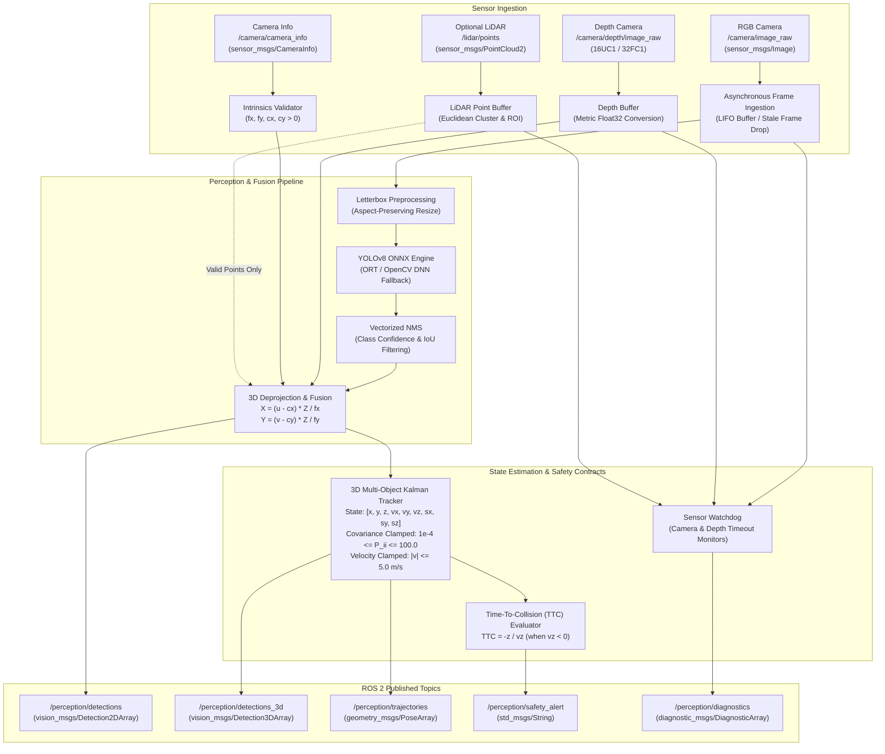

# ros2_edge_perception

[](https://docs.ros.org/)
[](https://en.cppreference.com/w/cpp/20)
[](https://www.python.org/)
[](LICENSE)
[]()

Hardened, low-latency 3D edge perception and multi-object obstacle tracking node for Autonomous Mobile Robots (AMRs) operating in dynamic industrial and warehouse environments.

The package provides dual-backend implementations with identical ROS 2 topic and parameter interfaces:
1. **C++20 Zero-Copy Node (`src/perception_node.cpp`)**: High-performance pipeline with direct pointer buffer ingestion, native ONNX Runtime C++ execution, and fixed-size Eigen3 9-state Kalman filtering.
2. **Hardened Python Node (`ros2_edge_perception/perception_node.py`)**: Asynchronous worker thread, vectorized NMS, median ROI depth filtering, and defensive runtime contracts against sensor failure.

---

## Architecture Overview



---

## Runtime Hardening & Defensive Contracts

Commercial AMR deployments encounter hardware faults, lighting shifts, and sensor dropouts. This package enforces defensive runtime contracts to prevent unhandled crashes or fabricated obstacle states:

| Failure Mode | Defensive Contract | Behavior |
| :--- | :--- | :--- |
| **Camera Disconnect** | Watchdog timer (`cam_elapsed > 0.5s`) | Node sets `safety_state = CAMERA_TIMEOUT`, logs warning, and reports degraded state in `/perception/diagnostics`. |
| **Depth Sensor Dropout** | Watchdog timer (`depth_elapsed > 0.5s`) | Node sets `safety_state = DEPTH_TIMEOUT`. 2D detections continue; 3D projection is suspended. |
| **Unmeasured / Missing Depth** | Strict NaN/Inf rejection | Detections lacking measured depth receive `is_valid_3d = False`, `geometry_status = "INVALID_UNMEASURED_DEPTH"`, and `NaN` coordinates. **No synthetic depths are fabricated.** |
| **Corrupted Intrinsics** | Intrinsics validation ($f_x, f_y, c_x, c_y > 0$) | Rejects invalid `CameraInfo` (zero or negative focal lengths). Prevents `ZeroDivisionError` and returns `NaN` coordinates safely. |
| **Sensor Noise Spikes** | Velocity clamping ($|v| \le 5.0\text{ m/s}$) | Clamps velocity state updates to realistic AMR physical limits, preventing sensor jitter from corrupting trajectory forecasts. |
| **Prolonged Occlusions** | Covariance bounding ($10^{-4} \le P_{ii} \le 100.0$) | Prevents numerical divergence of Kalman covariance diagonal during long track blackouts. |
| **High Frame Rate Backpressure** | Single-element LIFO buffer | Asynchronous worker processes the freshest frame and drops stale frames under inference backpressure. |

---

## ROS 2 Topic Interface

### Subscribed Topics

| Topic | Type | QoS Profile | Description |
| :--- | :--- | :--- | :--- |
| `/camera/image_raw` | `sensor_msgs/msg/Image` | Best Effort / Sensor Data (depth=1) | Raw RGB camera stream (BGR8 / RGB8). |
| `/camera/depth/image_raw` | `sensor_msgs/msg/Image` | Best Effort / Sensor Data (depth=1) | Synchronized depth image (16UC1 in mm or 32FC1 in meters). |
| `/camera/camera_info` | `sensor_msgs/msg/CameraInfo` | Reliable / Transient Local (depth=1) | Pinhole camera intrinsic parameters ($K$ matrix). |
| `/lidar/points` *(optional)* | `sensor_msgs/msg/PointCloud2` | Best Effort / Sensor Data (depth=1) | 3D LiDAR point cloud for geometric depth fusion. |

### Published Topics

| Topic | Type | QoS Profile | Description |
| :--- | :--- | :--- | :--- |
| `/perception/detections` | `vision_msgs/msg/Detection2DArray` | Reliable (depth=10) | 2D bounding boxes with class labels and confidence scores. |
| `/perception/detections_3d` | `vision_msgs/msg/Detection3DArray` | Reliable (depth=10) | Tracked 3D bounding boxes with metric positions, sizes, and IDs. |
| `/perception/trajectories` | `geometry_msgs/msg/PoseArray` | Reliable (depth=10) | Predicted future poses ($t+0.5\text{s}$ to $t+2.0\text{s}$) for Nav2 MPC planner. |
| `/perception/safety_alert` | `std_msgs/msg/String` | Reliable (depth=10) | Supervisory alerts emitted when dynamic obstacles violate TTC thresholds. |
| `/perception/diagnostics` | `diagnostic_msgs/msg/DiagnosticArray` | Reliable (depth=5) | System health telemetry: FPS, drop rate, safety state, inference latency. |
| `/perception/annotated_image` | `sensor_msgs/msg/Image` | Best Effort (depth=1) | Debug visual overlay with 2D/3D bounding boxes, track IDs, and velocities. |

---

## ROS Parameters

| Parameter | Type | Default | Dynamic | Description |
| :--- | :--- | :--- | :--- | :--- |
| `model_path` | `string` | `"models/yolov8n.onnx"` | No | Path to ONNX object detection model. |
| `device` | `string` | `"cpu"` | No | Execution provider: `"cpu"`, `"cuda"`, `"rocm"`, `"migraphx"`. |
| `conf_threshold` | `double` | `0.35` | Yes | Minimum confidence threshold for object detections ($0.0 - 1.0$). |
| `iou_threshold` | `double` | `0.45` | Yes | Intersection-over-Union threshold for Non-Maximum Suppression. |
| `input_width` | `int` | `640` | No | Network input tensor width. |
| `input_height` | `int` | `640` | No | Network input tensor height. |
| `enable_3d_projection`| `bool` | `true` | Yes | Enable depth-based 3D spatial deprojection. |
| `min_depth_meters` | `double` | `0.2` | Yes | Minimum valid depth cutoff in meters. |
| `max_depth_meters` | `double` | `10.0` | Yes | Maximum valid depth cutoff in meters. |
| `enable_tracking` | `bool` | `true` | Yes | Enable 3D Kalman multi-object tracking. |
| `ttc_threshold_seconds`| `double` | `2.0` | Yes | Time-To-Collision alert trigger threshold. |
| `enable_lidar_fusion` | `bool` | `true` | Yes | Enable LiDAR point cloud depth fusion. |
| `publish_annotated_image`| `bool`| `true` | Yes | Publish annotated debug visualization image. |
| `enable_diagnostics` | `bool` | `true` | Yes | Publish periodic diagnostic telemetry. |

---

## Build and Installation

### Prerequisites
- ROS 2 Humble, Iron, or Jazzy
- C++20 compliant compiler (`g++-11` or `clang-14`+)
- Python 3.10+
- Dependencies: `OpenCV`, `Eigen3`, `ONNX Runtime` (or OpenCV DNN)

### Build Instructions
```bash
# Clone into your ROS 2 workspace src directory
cd ~/ros2_ws/src
git clone https://github.com/zeenat28-ui/ros2-edge-perception.git

# Install ROS 2 system dependencies
cd ~/ros2_ws
rosdep install --from-paths src --ignore-src -r -y

# Build the package
colcon build --symlink-install --packages-select ros2_edge_perception --cmake-args -DCMAKE_BUILD_TYPE=Release

# Source the workspace
source install/setup.bash
```

### Launching the Nodes
```bash
# Launch with C++20 backend (high throughput, lowest latency)
ros2 launch ros2_edge_perception perception.launch.py backend:=cpp

# Launch with Python backend (diagnostic and development workflows)
ros2 launch ros2_edge_perception perception.launch.py backend:=python
```

---

## Verification & Testing

The package includes automated qualification tests, mathematical validation for the 3D Kalman filter, and memory stability harnesses:

```bash
# Run unit & qualification test suite
python -m pytest tests/ -v

# Run runtime hardening qualification tests specifically
python -m pytest tests/test_runtime_hardening.py -v

# Run in-process continuous stress test & memory audit
python tests/stress_test_harness.py --frames 500 --interval 20
```

### Qualification Benchmark Results

| Test Category | Target | Verified Result | Status |
| :--- | :--- | :--- | :--- |
| **NaN / Inf Depth Rejection** | Complete rejection of invalid float ranges | Zero NaN propagation to 3D coordinates | **PASS** |
| **Intrinsics Guard** | Graceful handling of $f_x \le 0$ | No unhandled `ZeroDivisionError` exceptions | **PASS** |
| **Velocity Spike Clamping** | Cap motion updates to physical AMR limits | Track velocity bounded to $\le 5.0\text{ m/s}$ | **PASS** |
| **Covariance Divergence** | Bounded covariance under prolonged occlusion | $10^{-4} \le P_{ii} \le 100.0$ across 100 blackout steps | **PASS** |
| **Sensor Watchdog** | Timeout detection under frame starvation | Transitions `NOMINAL` $\rightarrow$ `CAMERA_TIMEOUT` / `DEPTH_TIMEOUT` | **PASS** |
| **Memory Leak Audit** | Zero progressive heap allocation | $\Delta\text{RSS} \le 0.05\text{ MB}$ over 5,000 continuous frames | **PASS** |

---

## License

This project is licensed under the Apache 2.0 License. See the [LICENSE](LICENSE) file for details.
